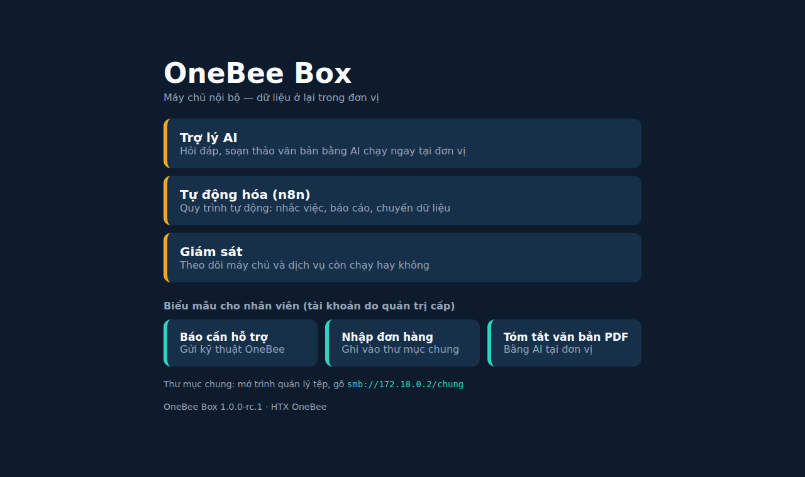

<p align="center">
  
</p>

<h1 align="center">🐧 Hệ điều hành & Tự động hóa Open Source</h1>

<p align="center">
  <strong>OneBee OS — máy văn phòng Linux tiếng Việt + máy chủ nội bộ có AI chạy tại chỗ, cho HTX và doanh nghiệp nhỏ</strong>
</p>

<p align="center">
  <a href="https://github.com/mthien07/da3-he-dieu-hanh-va-tu-dong-hoa-open-source/actions/workflows/ci.yml"></a>
  <a href="https://github.com/mthien07/da3-he-dieu-hanh-va-tu-dong-hoa-open-source/releases"></a>
  <a href="LICENSE"></a>
  <a href="https://github.com/mthien07/da3-he-dieu-hanh-va-tu-dong-hoa-open-source/commits"></a>
  
  
</p>

<p align="center">
  <a href="docs/huong-dan/huong-dan-cai-dat-tu-a-den-z.md"><b>📖 Cài từ A đến Z</b></a> ·
  <a href="#-tài-liệu">Tài liệu</a> ·
  <a href="tests/README.md">Kiểm thử</a> ·
  <a href="docs/kiem-thu-tren-may-that.md">Kết quả kiểm thử</a> ·
  <a href="SECURITY.md">Bảo mật</a> ·
  <a href="CONTRIBUTING.md">Đóng góp</a>
</p>

---

## 🎯 Vấn đề
- Máy văn phòng ở HTX, hộ kinh doanh, doanh nghiệp nhỏ thường dùng phần mềm không bản quyền → rủi ro pháp lý, dễ nhiễm mã độc.
- Không có người chuyên CNTT: không ai sao lưu, cập nhật, không ai hỗ trợ khi máy hỏng.
- Muốn dùng AI nhưng ngại đưa dữ liệu nội bộ lên dịch vụ nước ngoài.

## 💡 Sản phẩm
| Thành phần | Làm gì |
|---|---|
| **OneBee OS Desktop** | Bộ cài biến Linux Mint 22 thành máy văn phòng tiếng Việt: gõ Telex (IBus + Bamboo), LibreOffice lưu mặc định .docx/.xlsx, font thay thế giữ bố cục file Word, tự cập nhật, tự sao lưu lên Box, lệnh `hoi` hỏi Trợ lý AI, báo cần hỗ trợ, hỗ trợ từ xa có đồng ý |
| **OneBee Box** | Bộ cài máy chủ nội bộ (Ubuntu Server 24.04): Trợ lý AI tiếng Việt chạy tại chỗ (Gemma 4 qua Ollama + Open WebUI), tự động hóa n8n gửi email (báo cáo sao lưu, nhắc hạn thuế/BHXH, đơn hàng, tóm tắt PDF, sổ hỗ trợ), thư mục chung, sao lưu 2 tầng chống mã độc tống tiền, quản lý và cập nhật máy trạm từ 1 lệnh |
| **Dịch vụ** | Khảo sát → sao lưu nguyên ổ Windows → cài → đào tạo 3 buổi → bảo trì (theo dõi báo cáo hằng ngày, xử lý yêu cầu hỗ trợ có đo thời gian) |

```
 Máy trạm (Linux Mint + OneBee OS)                 OneBee Box (Ubuntu Server 24.04, trong LAN)
 ├─ gõ tiếng Việt, LibreOffice          sao lưu    ├─ Trợ lý AI: Open WebUI + Ollama (Gemma 4) — không gửi dữ liệu ra ngoài
 ├─ onebee-sao-luu (12:00)         ───────────────▶├─ restic rest-server (chỉ-thêm) → ổ ngoài 23:00
 ├─ onebee-bao-tinh-trang (mỗi giờ) ──────────────▶├─ n8n: email báo cáo, nhắc hạn, đơn hàng, sổ hỗ trợ, khảo sát
 ├─ hoi "câu hỏi"                   ──────────────▶├─ Samba: thư mục chung
 └─ onebee-ho-tro (khi người dùng bấm)◀──SSH────── └─ onebee-box: them-may, may-tram, cap-nhat-may, bao-cao-tuan …
```

<table>
  <tr>
    <td width="50%"><br/><sub>Trang giới thiệu của OneBee Box trong mạng LAN</sub></td>
    <td width="50%"><br/><sub>Trợ lý AI tiếng Việt chạy tại chỗ soạn thông báo họp HTX</sub></td>
  </tr>
</table>

<sub>Ảnh chụp từ Box chạy trong môi trường kiểm thử, không phải tại đơn vị thật.</sub>

## 🚀 Cài đặt
> **Người không chuyên**: làm theo [Hướng dẫn cài từ A đến Z](docs/huong-dan/huong-dan-cai-dat-tu-a-den-z.md) — có sơ đồ, từng lệnh dán được, kết quả phải thấy.

Bản phát hành (file nén + SHA256SUMS): [Releases](https://github.com/mthien07/da3-he-dieu-hanh-va-tu-dong-hoa-open-source/releases).
Tự thử trên máy ảo trước khi cài cho đơn vị: [thu-nghiem-tren-may-ao.md](docs/huong-dan/thu-nghiem-tren-may-ao.md).

**Máy trạm** — Linux Mint 22.x 64-bit, có Internet:
```bash
sudo apt install -y git
git clone https://github.com/mthien07/da3-he-dieu-hanh-va-tu-dong-hoa-open-source.git onebee
cd onebee && sudo ./desktop/onebee-install.sh
```
**Box** — Ubuntu Server 24.04 LTS 64-bit trong LAN: như trên, lệnh cuối là `sudo ./box/onebee-box-install.sh`.

## 📚 Tài liệu
| Việc | Tài liệu |
|---|---|
| **Cài từ A đến Z cho người không chuyên** | [huong-dan-cai-dat-tu-a-den-z.md](docs/huong-dan/huong-dan-cai-dat-tu-a-den-z.md) |
| Cài máy trạm / Box | [cai-dat-onebee-os-desktop.md](docs/huong-dan/cai-dat-onebee-os-desktop.md) · [cai-dat-onebee-box.md](docs/huong-dan/cai-dat-onebee-box.md) |
| Cài nhiều máy, sao lưu Windows bằng Clonezilla | [cai-hang-loat.md](docs/huong-dan/cai-hang-loat.md) |
| Trợ lý AI, quy trình tự động, email | [dung-tro-ly-ai-va-quy-trinh-tu-dong.md](docs/huong-dan/dung-tro-ly-ai-va-quy-trinh-tu-dong.md) |
| Quản lý, cập nhật máy trạm, hỗ trợ từ xa | [quan-ly-may-tram.md](docs/huong-dan/quan-ly-may-tram.md) |
| Chạy thử tại đơn vị, đào tạo, tờ phím tắt | [chay-thu-tai-don-vi.md](docs/huong-dan/chay-thu-tai-don-vi.md) · [dao-tao-buoi-1-3.md](docs/huong-dan/dao-tao-buoi-1-3.md) · [to-phim-tat.md](docs/huong-dan/to-phim-tat.md) |
| Đo trước/sau | [do-truoc-sau.md](docs/huong-dan/do-truoc-sau.md) |
| Kinh doanh: cách tính giá, mẫu hợp đồng (nháp), khảo sát khách | [docs/kinh-doanh/](docs/kinh-doanh/) |
| Quyết định kiến trúc | [docs/adr/](docs/adr/) · Thay đổi: [project-changelog.md](docs/project-changelog.md) |

## 📌 Trạng thái (1.0.0-rc.1 — bản thử)
- ✅ Đủ tính năng cho 1 đơn vị: máy trạm, Box, Trợ lý AI, quy trình email, quản lý máy trạm, hỗ trợ từ xa, sổ hỗ trợ + khảo sát,
  giám sát, HTTPS nội bộ (CA riêng của Box), xoay khóa, **khôi phục toàn bộ Box khi hỏng ổ**.
- ✅ Kiểm thử tự động ngày 10–11/10/2026 ([chi tiết](docs/kiem-thu-tren-may-that.md)):
  unit test Box 100 bài + Desktop 39 bài + AI 17 bài; lint với ansible-core 2.19 và **2.16** (bản trên Ubuntu 24.04);
  Desktop trong container Linux Mint 22.3 (5 kịch bản, 83 PASS); **Box đầy đủ trên Docker Desktop** với model sản phẩm `gemma4:e2b-it-qat`
  (cài 2 lần, AI, n8n qua email, sao lưu, máy trạm, quản lý tập trung, tường lửa, hỏng ổ → khôi phục, bật/tắt HTTPS, xoay khóa, khởi động lại) —
  mọi bước đạt khi chạy nối tiếp sau các bản sửa; kết quả lần chạy lại từ đầu ghi trong phiếu kiểm thử.
  Lần chạy này tìm và sửa 2 lỗi sản phẩm + 2 lỗi trong bộ kiểm thử.
- ✅ Model AI chọn bằng bộ chấm 40 câu tiếng Việt (98%): [ADR 0003](docs/adr/0003-chon-model-ai-gemma.md), [reports/ai/](reports/ai/).
- ⏳ **Chưa cài trên máy thật tại đơn vị nào** (phiên Cinnamon thật, phần cứng, LAN thật, tốc độ AI) → [danh sách thử](docs/huong-dan/thu-nghiem-tren-may-ao.md); đạt thì phát hành 1.0.0.
- ⏳ Chạy thử 4 tuần tại HTX OneBee → số liệu thật cho giá, video hướng dẫn.

Mọi con số về tốc độ, chi phí, tiết kiệm chỉ công bố khi có file đo trong `reports/`. Hiện **chưa có** số đo trên máy thật.

## 💰 Giá dịch vụ
Chưa có giá chính thức — tính từ chi phí thật của đợt chạy thử: [bang-gia.md](docs/kinh-doanh/bang-gia.md).
Dải giá trong hồ sơ hội thi là giả định nội bộ, chưa có cơ sở chi phí.

## 🤝 Đóng góp và bảo mật
- Báo lỗi / đề xuất: [Issues](https://github.com/mthien07/da3-he-dieu-hanh-va-tu-dong-hoa-open-source/issues) (có mẫu sẵn) · Hướng dẫn đóng góp, cách chạy kiểm thử: [CONTRIBUTING.md](CONTRIBUTING.md)
- Lỗ hổng bảo mật: **báo riêng**, không mở Issue — [SECURITY.md](SECURITY.md) · Quy tắc ứng xử: [CODE_OF_CONDUCT.md](CODE_OF_CONDUCT.md)
- Thấy dự án hữu ích? Bấm ⭐ để nhiều HTX biết tới hơn.

## ⚖️ Giấy phép
Mã nguồn repo: **MIT** ([LICENSE](LICENSE)). Thành phần giữ giấy phép của tác giả ([LICENSES.md](LICENSES.md)). Lưu ý khi giới thiệu "mã nguồn mở":
| Thành phần | Giấy phép |
|---|---|
| Linux Mint/Ubuntu, LibreOffice, IBus/Bamboo, Ollama, restic, Samba, Caddy, Uptime Kuma, x11vnc | Nguồn mở (chuẩn OSI) |
| Gemma 4 | Apache-2.0 (theo model card — kiểm lại trước khi ghi vào hợp đồng) |
| Open WebUI | BSD-3 + điều khoản thương hiệu (không gỡ/đổi thương hiệu khi > 50 người dùng) |
| n8n | Sustainable Use License — **fair-code, không phải nguồn mở chuẩn OSI**; chỉ cài cho nhu cầu nội bộ của khách |

## 🖥️ Demo web và hồ sơ hội thi
`demo/index.html` là giao diện **mô phỏng** (số liệu minh họa, không chạy AI thật). Hồ sơ dự thi: `docs/hoi-thi/`.

## 📞 Liên hệ

**Hợp tác xã OneBee**
- 📍 45 đường số 6, KDC Thái Dương, Phường Long An, Tây Ninh
- 📱 0385 944 909
- 🔢 MST: 1102128064
- 👤 Người đại diện: HUỲNH TRỌNG HIẾU

---

<p align="center">
  <em>Dự án dự thi Hội thi Khởi nghiệp Đổi mới Sáng tạo tỉnh Tây Ninh năm 2026</em><br/>
  <strong>🐝 HTX OneBee — Chuyển đổi số cho cộng đồng</strong>
</p>
