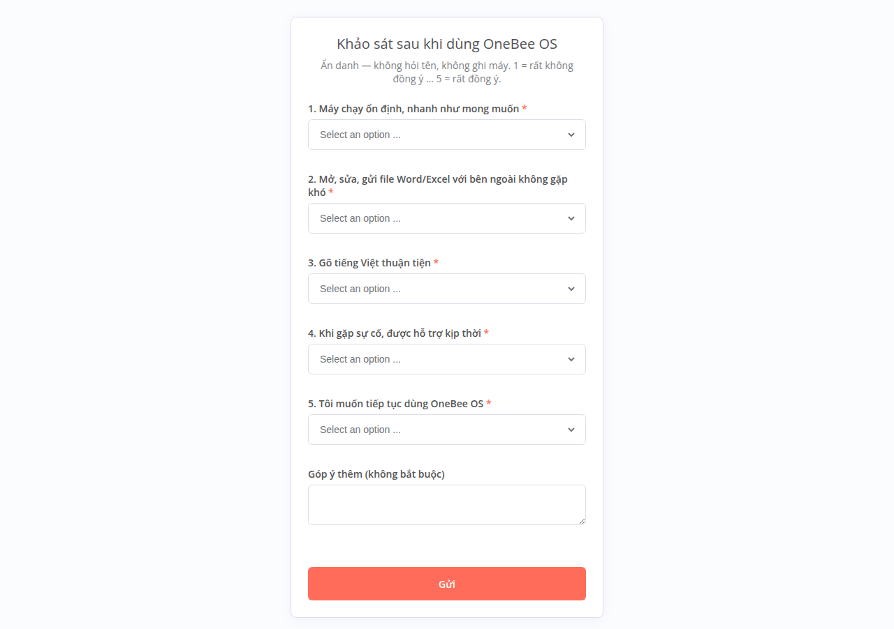

# Chạy thử OneBee OS tại đơn vị (mô hình điểm 4 tuần)

Áp dụng trước hết cho HTX OneBee (2–5 máy + 1 Box), sau đó cho khách hàng đầu tiên. Mục tiêu: **số liệu thật** thay mọi
con số giả định trong hồ sơ, bảng giá, demo.

## 1. Trước khi cài (tuần 0)
**Anh chốt ngưỡng "đạt" trước khi bắt đầu** — đề xuất (anh sửa rồi ghi vào `reports/pilot/nguong-dat.md`):
| Tiêu chí | Đề xuất |
|---|---|
| Mất dữ liệu | 0 lần |
| Số yêu cầu hỗ trợ tuần 4 | thấp hơn tuần 1 |
| Máy/phần mềm phải quay về Windows | ≤ 1 máy, có lý do ghi rõ |
| Khảo sát cuối tuần 4, câu 5 "muốn tiếp tục dùng" | trung bình ≥ 3,5/5 |
| Yêu cầu "gấp" được xử lý trong ngày | 100% |

Khảo sát từng máy (ghi vào bảng ở [cai-hang-loat.md](cai-hang-loat.md), mục 5):
- [ ] Người dùng, công việc chính, **phần mềm đang dùng** (phần mềm kế toán, hóa đơn điện tử, chữ ký số, phần mềm ngân hàng,
      phần mềm chỉ chạy trên Windows → giữ 1 máy Windows hoặc chạy trên web).
- [ ] 3–5 **file mẫu** người dùng hay mở (Word/Excel có bảng, công thức, font lạ) → mở thử bằng LibreOffice trước.
- [ ] Máy in, máy quét, USB token chữ ký số: tên máy, cách kết nối. Thử bằng USB Mint chạy thử (chưa cài).
- [ ] Cấu hình máy (CPU, RAM, ổ HDD/SSD) + **đo "trước"** theo [do-truoc-sau.md](do-truoc-sau.md).
- [ ] Giữ **1 máy Windows dự phòng** cho việc gấp trong 4 tuần.

Cài: Box trước ([cai-dat-onebee-box.md](cai-dat-onebee-box.md)), cấu hình email; rồi từng máy theo
[cai-hang-loat.md](cai-hang-loat.md) (**sao lưu nguyên ổ Windows bằng Clonezilla trước**). Đào tạo theo
[dao-tao-buoi-1-3.md](dao-tao-buoi-1-3.md), phát [to-phim-tat.md](to-phim-tat.md) (in, dán cạnh màn hình).

## 2. Trong 4 tuần
Hằng ngày (kỹ thuật, 5 phút): đọc email báo cáo 23:00 (sao lưu + tình trạng máy) và email yêu cầu hỗ trợ.
Người dùng báo sự cố bằng menu **"Báo cần hỗ trợ (OneBee)"** (hoặc gọi điện — kỹ thuật tự nhập vào biểu mẫu để không sót).
Xử lý xong: kỹ thuật mở `http://<ip-box>:5678/form/onebee-xu-ly` (tài khoản `kythuat`, mật khẩu dòng `bieu-mau-kythuat`
trong `sudo onebee-box in-khoa`), nhập mã yêu cầu, cách xử lý, số phút.

Cuối mỗi tuần (thứ Sáu):
```bash
sudo onebee-box bao-cao-tuan > nhat-ky-tuan-1.md      # hoặc: sudo onebee-box bao-cao-tuan 2026-10-09
```
Điền phần "Kỹ thuật ghi thêm" (giờ công, phần cứng thay, file không mở được), lưu vào `reports/pilot/nhat-ky-tuan-N.md`.
Nhật ký không chứa tên người báo, nội dung mô tả, góp ý → đưa vào báo cáo được.



Cuối tuần 2 và tuần 4: gửi đường link khảo sát `http://<ip-box>:5678/form/onebee-khao-sat` (ẩn danh, 5 câu, 2 phút).
Cần ít nhất 3 phiếu thì nhật ký mới hiện điểm (giữ ẩn danh ở đơn vị nhỏ). Gửi link cho mọi người cùng lúc, **chạy
`bao-cao-tuan` sau khi đã thu đủ phiếu** (chạy giữa chừng rồi chạy lại sau 1 phiếu mới có thể đoán ra điểm của người đó).

## 3. Đường lui
Việc gấp không làm được trên OneBee OS: dùng máy Windows dự phòng ngay, ghi yêu cầu hỗ trợ loại "Phần mềm chỉ chạy trên Windows".
Người dùng không chịu được: khôi phục ảnh Clonezilla của máy đó (`restoredisk`, khoảng thời gian như lúc sao lưu), ghi lý do.
Dữ liệu đã làm trên OneBee OS: lấy từ bản sao lưu trên Box hoặc thư mục `/home` trước khi khôi phục.

## 4. Kết thúc (tuần 4)
- Đo "sau" trên đúng các máy đã đo "trước".
- Viết `reports/pilot/bao-cao-pilot.md` theo mẫu [../../reports/pilot/mau-bao-cao-pilot.md](../../reports/pilot/mau-bao-cao-pilot.md): so với ngưỡng đã chốt.
- **Dữ liệu thật của đơn vị không đưa lên repo công khai**: chỉ đưa nhật ký tuần (đã ẩn tên) và số đo; không đưa file CSV gốc,
  file mẫu của người dùng, tên khách hàng, số liệu kế toán.
