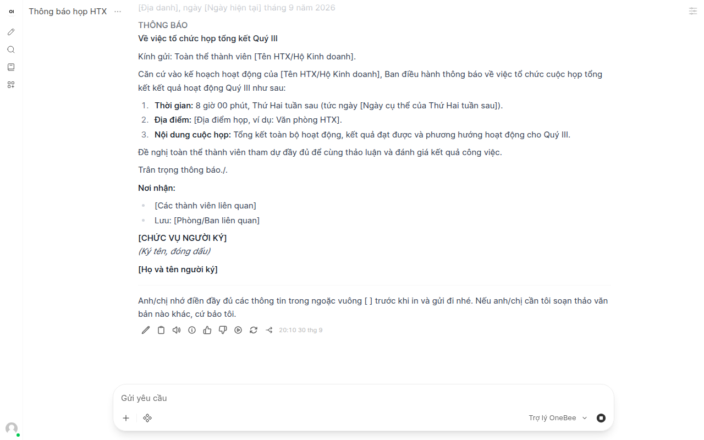
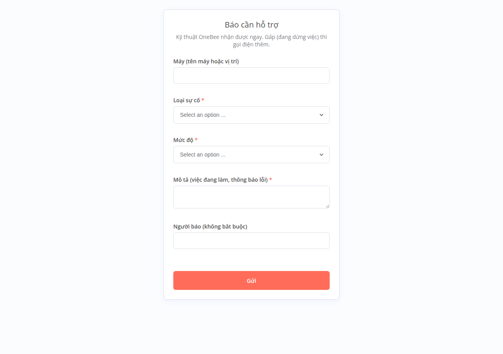

# Hướng dẫn dùng Trợ lý AI và quy trình tự động (OneBee Box v0.2)

## 1. Trợ lý AI (Open WebUI)
- Mở `http://<ip-box>:3000`. Tài khoản quản trị tạo sẵn: `quantri@onebee.lan`, mật khẩu xem bằng `sudo onebee-box in-khoa`
  (dòng `webui-admin-password`). **Đăng ký tự do đã tắt** — quản trị tạo tài khoản cho nhân viên trong
  Bảng quản trị → Người dùng.
- **Mỗi nhân viên một tài khoản** (không dùng chung): quản trị tạo trong Bảng quản trị → Người dùng, nhân viên nghỉ việc thì xóa.
  Bộ cài đặt sẵn (và áp lại mỗi lần chạy, kể cả trên Box đã cài): tài khoản quản trị Open WebUI **không xem được chat của nhân viên và
  không xuất được** (tắt `ENABLE_ADMIN_CHAT_ACCESS`, `ENABLE_ADMIN_EXPORT` — đã đối chiếu mã nguồn v0.11.4: chặn xem chat người khác
  qua giao diện/API, xuất toàn bộ chat, tải file CSDL), nhân viên **không chia sẻ chat** cho nhau, không chia sẻ lên cộng đồng, tắt Functions/Tools (mã Python tự thêm), phiên đăng nhập
  giữ **30 ngày** rồi phải đăng nhập lại. Nên báo trước cho nhân viên đúng phạm vi: đây là chặn trên Open WebUI, **không phải mã hóa** — quản trị vẫn **đặt lại được mật khẩu**
  của nhân viên rồi đăng nhập bằng tài khoản đó (đã đối chiếu mã nguồn: `update_user_by_id`; nhân viên sẽ biết vì mật khẩu cũ không còn dùng
  được), và người có quyền root trên Box vẫn đọc được file dữ liệu (`/srv/onebee/open-webui`) và bản sao lưu của nó; thư mục `/home` trên máy trạm cũng nằm trong bản
  sao lưu mà quản trị Box đọc được (xem "Quyền riêng tư" trong hướng dẫn cài Box).
  Lệnh `hoi` dùng khóa của **từng nhân viên** (mục 2); khóa theo từng **máy** chỉ còn là giai đoạn chuyển tiếp.
- Chọn **"Trợ lý OneBee"**: model Gemma chạy trên Box + lời dặn tiếng Việt (không bịa số liệu, hướng dẫn máy OneBee,
  biết ngày hôm nay, được nhờ soạn văn bản thì soạn ngay, chỗ thiếu để [trong ngoặc vuông]).


- Model đang dùng: `gemma4:e2b-it-qat` (Gemma 4 của Google, giấy phép Apache-2.0, tải 4,3 GB) — bản Gemma nhẹ nhất vượt
  ngưỡng chất lượng khi chấm 40 câu × 3 lần (xem ADR 0003, `reports/ai/`). Đổi model: sửa `onebee_box_ai_model` trong
  `box/ansible/group_vars/all.yml` rồi chạy lại bộ cài. **Tốc độ trên máy Box thật chưa đo.**

## 2. Lệnh `hoi` trên máy trạm
```bash
hoi cách xuất file PDF
hoi "tóm tắt đoạn này thành 3 ý" < bien-ban.txt
```
Bật cho 1 máy: trên Box chạy `sudo onebee-box them-may <tên-máy>` → dán kết quả vào máy trạm tại
`/etc/onebee/may-tram.env` → chạy lại bộ cài OneBee OS trên máy trạm (vừa bật sao lưu vừa bật `hoi`).

**Mỗi nhân viên dùng khóa riêng của mình** (hỏi bằng tài khoản của mình, thu hồi được từng người). Làm một lần trên máy, chọn một cách:
```bash
hoi --dang-nhap   # nhập email + mật khẩu Trợ lý AI của bạn; hoi lấy khóa rồi CHỈ lưu khóa (không lưu mật khẩu); cần Box đã bật HTTPS
hoi --dan-khoa    # tự tạo khóa trên web (Cài đặt → Tài khoản → Khóa API) rồi dán vào; hoi thử khóa trước khi lưu
hoi --dang-xuat   # xóa khóa của bạn khỏi máy này
```
Khóa lưu ở `~/.config/onebee/hoi-khoa` (chỉ chính tài khoản Linux đó đọc; máy nhiều người thì mỗi người một khóa). Khóa chỉ gọi được hỏi đáp + danh sách model.
**Thu hồi**: quản trị xóa tài khoản nhân viên trên Open WebUI → khóa mất hiệu lực (`hoi` báo "đã bị thu hồi").
**Chuyển tiếp**: nhân viên chưa thiết lập khóa riêng thì `hoi` tạm dùng khóa chung của máy (`/etc/onebee-hoi.conf`, **mọi tài khoản trên máy đọc được**) kèm nhắc.
Khi mọi nhân viên đã dùng khóa riêng: đặt `onebee_box_hoi_khoa_may: false` trong `box/ansible/group_vars/all.yml`, chạy lại bộ cài, `sudo onebee-box dong-bo-may --tat-ca`,
rồi `sudo onebee-box go-khoa-hoi-may` (xóa các tài khoản `may-<tên>@onebee.lan`). Từ đó `them-may` thôi cấp khóa theo máy. Cấu hình địa chỉ ở `/etc/onebee-hoi.conf`;
mật khẩu sao lưu ở `/etc/onebee/` chỉ root đọc được.

**Đổi mật khẩu quản trị (Trợ lý AI, n8n) trên giao diện web**: ghi mật khẩu mới vào file tương ứng trong
`/etc/onebee-box/secrets/` (`webui-admin-password`) — nếu không, bộ cài vẫn chạy nhưng báo cảnh báo và không cập nhật được
"Trợ lý OneBee". Tài khoản chủ n8n do bộ cài quản lý (`N8N_INSTANCE_OWNER_MANAGED_BY_ENV`) — **không đổi mật khẩu chủ
n8n trên giao diện** (chưa kiểm n8n có đặt lại theo bộ cài hay không); dùng mật khẩu trong `in-khoa`.

## 3. Quy trình tự động (n8n, `http://<ip-box>:5678`)
Tài khoản chủ tạo sẵn: `quantri@onebee.lan`, mật khẩu dòng `n8n-owner-password` trong `in-khoa`.

| Quy trình | Chạy khi | Kết quả |
|---|---|---|
| Báo cáo sao lưu | Sau mỗi lần sao lưu 23:00 (và `onebee-box email-thu`) | Email ĐẠT/LỖI + tình trạng từng máy trạm (sao lưu, cập nhật, ổ đĩa, mất liên lạc) |
| Nhắc hạn nộp báo cáo, thuế | 7:30 hằng ngày | Email khi còn 7, 3, 1 ngày và đúng ngày hạn |
| Tóm tắt văn bản PDF | Nhân viên mở `http://<ip-box>:5678/form/onebee-tom-tat` | Bản tóm tắt 3/5/7 ý (AI trên Box) |
| Nhập đơn hàng | Nhân viên mở `http://<ip-box>:5678/form/onebee-don-hang` | Ghi vào thư mục chung `don-hang/` |
| Tổng hợp đơn hàng | 17:00 hằng ngày | Email số đơn, tổng tiền, theo mặt hàng |
| Báo cần hỗ trợ | Nhân viên mở menu "Báo cần hỗ trợ" hoặc `/form/onebee-ho-tro` | Ghi sổ + email kỹ thuật (GẤP ghi ở tiêu đề) |
| Xử lý yêu cầu hỗ trợ | Kỹ thuật mở `/form/onebee-xu-ly` (tài khoản `kythuat`) | Ghi cách xử lý, số phút |
| Khảo sát hài lòng | Gửi link `/form/onebee-khao-sat` (ẩn danh) | Ghi phiếu; `onebee-box bao-cao-tuan` tổng hợp |
| Nhận tình trạng máy trạm | Máy trạm gửi mỗi giờ | Lưu tình trạng cho `onebee-box may-tram` và email báo cáo 23:00 ([quan-ly-may-tram.md](quan-ly-may-tram.md)) |



Biểu mẫu đòi tài khoản `nhanvien`, mật khẩu dòng `bieu-mau-nhanvien` trong `in-khoa` (biểu mẫu xử lý: tài khoản `kythuat`, dòng `bieu-mau-kythuat`).
Sổ hỗ trợ và khảo sát nằm ở `/srv/onebee/ho-tro/` trên Box (chỉ root đọc, có trong bản sao lưu Box).

### Lịch nhắc hạn
Sửa `onebee_box_lich_han` trong `box/ansible/group_vars/all.yml` rồi chạy lại bộ cài. Lịch mặc định là **bản mẫu**:
- Thuế — Điều 44 Luật Quản lý thuế 38/2019/QH14: tờ khai tháng ngày 20 tháng sau; tờ khai quý ngày cuối tháng đầu quý sau;
  quyết toán năm ngày cuối tháng thứ 3. Luật Quản lý thuế 108/2025/QH15 (hiệu lực 1/7/2026) **chưa được đối chiếu**.
- BHXH — Điều 34 khoản 4 điểm a Luật BHXH 2024: đóng hằng tháng chậm nhất ngày cuối cùng của tháng tiếp theo.
- **Kế toán kiểm lại theo quy định hiện hành và cách khai của đơn vị.** Hạn trùng ngày nghỉ được lùi sang ngày làm việc kế tiếp
  (email chỉ nhắc theo ngày trên lịch, không tự lùi).

## 4. Cấu hình email (làm 1 lần)
1. Khai báo `onebee_box_email` trong `box/ansible/group_vars/all.yml`: `smtp_host`, `smtp_port`, `smtp_user`, `gui_tu`, `nhan`.
   (Gmail/Google Workspace: `smtp.gmail.com`, cổng 587, cần "mật khẩu ứng dụng".)
2. `sudo onebee-box dat-mat-khau-email` (nhập mật khẩu, không hiện trên màn hình).
3. Chạy lại `sudo ./box/onebee-box-install.sh`.
4. `sudo onebee-box email-thu` → kiểm tra hộp thư (cả mục Spam).

## Giới hạn (v0.2)
- AI có thể sai; model tạm chưa chấm trên máy Box thật.
- Tóm tắt chỉ đọc PDF có chữ (không đọc ảnh scan); tối đa 30 trang, cắt bớt nếu quá dài.
- Email đi qua máy chủ thư của đơn vị (ra Internet) và **có chứa dữ liệu kinh doanh** (tên khách, số lượng, số tiền trong
  email tổng hợp đơn hàng). Không gửi văn bản PDF hay câu hỏi AI qua email.
- Chưa kiểm trên máy thật; kiểm tự động trong container (xem `tests/README.md` — kết quả lần chạy gần nhất ghi trong changelog).
- Nhập lại quy trình mẫu (khi nâng cấp) sẽ ghi đè chỉnh sửa trên giao diện n8n của các quy trình mẫu — muốn sửa riêng thì
  nhân bản quy trình rồi sửa bản sao.
- n8n tự gọi `api.n8n.io` để tải danh mục máy chủ MCP (thấy trong nhật ký khi test). Chưa rà hết các kết nối ra ngoài khác của n8n.
