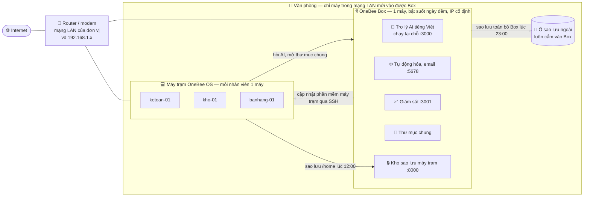
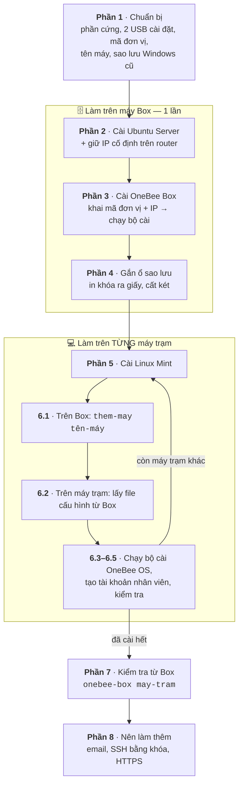
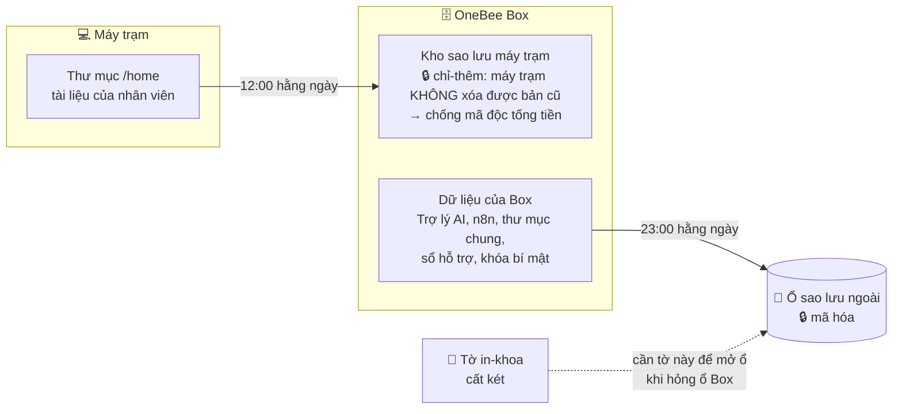
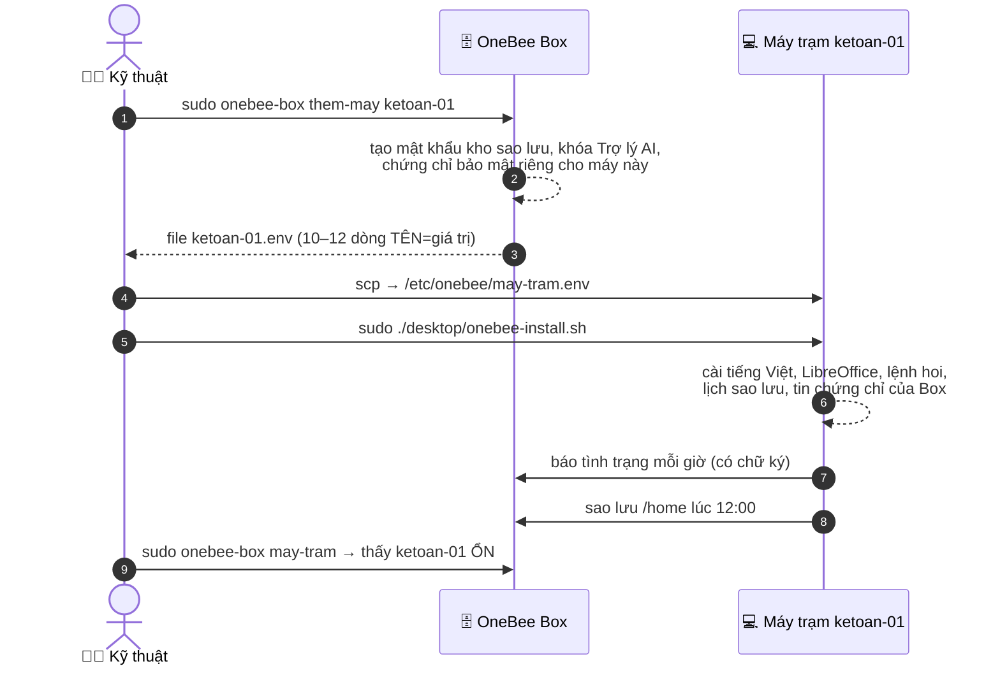

# Cài OneBee OS từ A đến Z — cho người không chuyên

Tài liệu này dẫn từng bước, từ lúc chuẩn bị máy đến khi nhân viên dùng được. Không cần biết Linux: chỉ cần **gõ (hoặc dán) đúng các lệnh
trong khung xám**, mỗi lần một khung, và đọc dòng kết quả cuối cùng.

> Lưu ý trung thực: bộ cài đã chạy đạt toàn bộ kiểm thử tự động trong máy ảo/container (Docker), nhưng **chưa được cài trên máy thật tại đơn vị nào**.
> Hãy làm thử trên máy ảo hoặc máy cũ trước ([thu-nghiem-tren-may-ao.md](thu-nghiem-tren-may-ao.md)), và gặp lỗi thì gửi file nhật ký cho kỹ thuật OneBee.

---

## Phần 0. Hiểu nhanh: OneBee OS gồm 2 loại máy

| Máy | Là gì | Bao nhiêu máy |
|---|---|---|
| **OneBee Box** | Máy chủ nhỏ đặt tại đơn vị, bật suốt ngày đêm. Chứa Trợ lý AI tiếng Việt (chạy tại chỗ, không gửi dữ liệu ra ngoài), thư mục chung, kho sao lưu, tự động gửi email | **1 máy** |
| **Máy trạm OneBee OS** | Máy văn phòng của nhân viên (Linux Mint + bộ cài OneBee): gõ tiếng Việt, mở file Word/Excel, tự sao lưu lên Box, hỏi Trợ lý AI | Mỗi nhân viên 1 máy |

### Hình 1. Sau khi cài xong, văn phòng của bạn trông như thế này

Điểm cần nhớ: dữ liệu và câu hỏi gửi Trợ lý AI **chỉ đi trong mạng LAN của văn phòng**. Internet chỉ dùng để tải phần mềm, cập nhật và gửi email báo cáo.

**Thứ tự làm:** Phần 1 (chuẩn bị) → Phần 2–3 (cài Box) → Phần 4 (ổ sao lưu) → Phần 5–6 (cài từng máy trạm) → Phần 7 (kiểm tra) → Phần 8–9 (tùy chọn).

### Hình 2. Các bước cài, theo thứ tự


### Vài điều cần biết trước khi gõ lệnh
- **Mở cửa sổ lệnh (Terminal)**: trên máy trạm Linux Mint bấm **Ctrl + Alt + T**. Trên Box (Ubuntu Server) thì màn hình đen chính là cửa sổ lệnh.
- **Dán lệnh** vào Terminal: **Ctrl + Shift + V** (không phải Ctrl + V). Gõ xong bấm **Enter**.
- Lệnh có chữ `sudo` sẽ hỏi **mật khẩu của tài khoản bạn đang dùng**. Khi gõ mật khẩu, màn hình **không hiện gì** (kể cả dấu *) — cứ gõ rồi Enter.
- Chỗ nào ghi trong dấu `< >` (ví dụ `<ip-box>`) là **bạn phải thay** bằng giá trị thật, và **bỏ cả dấu `< >`**.
- Sửa file bằng `nano`: dùng phím mũi tên để di chuyển, sửa chữ như bình thường. **Lưu: Ctrl + O rồi Enter. Thoát: Ctrl + X.**

---

## Phần 1. Chuẩn bị (làm 1 lần)

### 1.1. Phần cứng
| | OneBee Box | Mỗi máy trạm |
|---|---|---|
| CPU | 64-bit, 4 nhân trở lên | 64-bit (máy 32-bit **không** cài được) |
| RAM | **Tối thiểu 8 GB** (Trợ lý AI chiếm khoảng 4 GB). Nên 16 GB cho thoải mái *(khuyến nghị, chưa đo trên máy thật)* | 4 GB trở lên |
| Ổ cứng | 120 GB trở lên (chứa thư mục chung + sao lưu của các máy trạm) | 40 GB trở lên |
| Thêm | **1 ổ cứng gắn ngoài riêng** để Box tự sao lưu mỗi đêm | — |
| Mạng | Cắm dây mạng (LAN), có Internet khi cài | Có Internet khi cài |

Không cần card đồ họa. Trợ lý AI chạy được bằng CPU, chỉ trả lời chậm hơn.

### 1.2. Đồ cần chuẩn bị
- 2 USB (≥ 8 GB): một USB cài **Ubuntu Server 24.04 LTS** (tải ở ubuntu.com), một USB cài **Linux Mint 22.3 Cinnamon** (tải ở linuxmint.com).
  Ghi file cài vào USB bằng **balenaEtcher** hoặc **Rufus**.
- Tên viết tắt của đơn vị, **chữ thường, không dấu, không cách**, ví dụ HTX An Phú → `anphu`. Gọi là **mã đơn vị**.
- Đặt tên cho từng máy trạm theo bộ phận: `ketoan-01`, `kho-01`, `banhang-01`… (chữ thường, số, gạch giữa).
- Giấy và bút: bạn sẽ phải **in hoặc chép tay một số khóa bí mật** để cất két (Phần 4).

### 1.3. Máy đang chạy Windows? Sao lưu trước
Cài OneBee **xóa sạch ổ cứng**. Trước khi cài lên máy đang dùng Windows, sao lưu nguyên ổ bằng Clonezilla theo
[cai-hang-loat.md](cai-hang-loat.md) mục 1 (đường lui nếu muốn quay lại Windows), và chép riêng dữ liệu quan trọng ra ổ ngoài.
Nên thử USB Linux Mint ở chế độ "chạy thử" trước để chắc wifi, máy in, âm thanh hoạt động.

---

## Phần 2. Cài Ubuntu Server cho máy Box

1. Cắm USB Ubuntu Server, bật máy, bấm phím chọn thiết bị khởi động (thường là **F12**, **F11**, **F8** hoặc **Esc** tùy hãng) → chọn USB.
2. Làm theo trình cài:
   - Ngôn ngữ: **English** (bản Server không có tiếng Việt; không ảnh hưởng OneBee).
   - Bàn phím: English (US).
   - Kiểu cài: **Ubuntu Server** (không chọn bản "minimized").
   - Mạng: để tự nhận (DHCP). Ghi lại địa chỉ hiện ra, ví dụ `192.168.1.50`.
   - Ổ đĩa: **Use an entire disk** — chọn ổ trong của máy (**không** chọn ổ ngoài để sao lưu).
   - Tài khoản: đặt tên máy `onebee-box`, tên đăng nhập ví dụ `quantri`, và một **mật khẩu mạnh**. Ghi lại.
   - **Đánh dấu "Install OpenSSH server"** (để sau này chép cấu hình sang máy trạm).
   - Phần "Featured server snaps": **không chọn gì**.
3. Cài xong chọn **Reboot**, rút USB. Đăng nhập bằng tài khoản vừa tạo.

### 2.1. Giữ cho Box một địa chỉ IP cố định
Máy trạm tìm Box theo địa chỉ IP, nên **IP của Box không được đổi**. Xem IP hiện tại:
```bash
hostname -I
```
Số đầu tiên (ví dụ `192.168.1.50`) là IP của Box. Vào trang quản trị của **router/modem**, tìm mục **"DHCP Reservation"**, **"Gán IP tĩnh"**
hoặc **"Address Reservation"**, rồi gán IP này cho máy Box. Nếu không vào được router, nhờ bên lắp mạng làm giúp.

---

## Phần 3. Cài OneBee Box

### 3.1. Tải bộ cài
```bash
sudo apt update && sudo apt install -y git
git clone https://github.com/mthien07/da3-he-dieu-hanh-va-tu-dong-hoa-open-source.git onebee
cd onebee
```

### 3.2. Khai 2 thông tin bắt buộc
```bash
nano box/ansible/group_vars/all.yml
```
Tìm 2 dòng sau (gần đầu file) và điền vào giữa dấu ngoặc kép:
```yaml
onebee_box_ma_don_vi: "anphu"            # mã đơn vị ở mục 1.2
onebee_box_dia_chi: "192.168.1.50"       # IP cố định của Box ở mục 2.1
```
Lưu (**Ctrl + O**, Enter) và thoát (**Ctrl + X**).

> **Chốt 2 giá trị này trước khi cài máy trạm.** Đổi mã đơn vị hoặc IP về sau thì mọi máy trạm phải nhận lại chứng chỉ bảo mật mới.

Đơn vị có **nhiều mạng** (ví dụ phòng kế toán ở `192.168.2.x`)? Trong cùng file, sửa
`onebee_box_lan_cho_phep: ["192.168.1.0/24", "192.168.2.0/24"]`. Mặc định Box chỉ cho máy **cùng mạng** với nó truy cập.

### 3.3. Chạy bộ cài
```bash
sudo ./box/onebee-box-install.sh
```
- Lần đầu sẽ **tải nhiều GB** (phần mềm + Trợ lý AI; riêng phần AI đã hơn 7 GB). Thời gian phụ thuộc tốc độ mạng: lần thử trên một mạng gia đình
  khoảng 0,2–2 MB/s mất **hơn 3 giờ**. **Cứ để máy chạy, không tắt.**
- Thành công khi thấy dòng:
  `[OneBee Box] Hoàn tất. Mở trình duyệt vào http://<ip-box>/ để xem các dịch vụ.`
- Nếu báo `LỖI: …`, đọc kỹ câu báo (thường chỉ đúng chỗ cần sửa, ví dụ "Chưa khai onebee_box_ma_don_vi"), sửa rồi **chạy lại đúng lệnh trên**.
  Chạy lại nhiều lần là an toàn. Vẫn lỗi: gửi file nhật ký trong `/var/log/onebee/` cho kỹ thuật.

### 3.4. Lấy mật khẩu quản trị
```bash
sudo onebee-box in-khoa
```
Lệnh in ra các mật khẩu, trong đó:
- `webui-admin-password`: mật khẩu **Trợ lý AI**.
- `n8n-owner-password`: mật khẩu **Tự động hóa**.
- `uptime-kuma-password`: mật khẩu **Giám sát**.

Tài khoản đăng nhập Trợ lý AI và Tự động hóa là `quantri@onebee.lan`, còn Giám sát là `quantri`.

Từ một máy khác cùng mạng, mở trình duyệt vào `http://<ip-box>/`. Trang giới thiệu có nút tới từng dịch vụ:

| Dịch vụ | Địa chỉ | Dùng để |
|---|---|---|
| Trợ lý AI | `http://<ip-box>:3000` | Hỏi đáp, soạn văn bản bằng tiếng Việt |
| Tự động hóa (n8n) | `http://<ip-box>:5678` | Email báo cáo, nhắc hạn thuế/BHXH, đơn hàng, sổ hỗ trợ |
| Giám sát | `http://<ip-box>:3001` | Xem dịch vụ nào đang ngừng |
| Thư mục chung | `smb://<ip-box>/chung` | Chia sẻ file trong đơn vị (tài khoản `onebee`, mật khẩu: `sudo cat /etc/onebee-box/secrets/samba-onebee`) |

---

## Phần 4. Gắn ổ sao lưu cho Box (bắt buộc — đừng bỏ qua)

### Hình 3. Dữ liệu được sao lưu thế nào

Bản sao lưu của máy trạm nằm trên **ổ trong của Box**. Bản sao lưu của Box nằm trên **ổ ngoài**. Tờ `in-khoa` là chìa khóa để mở ổ ngoài,
nên **mất tờ này thì bản sao lưu vô dụng**.

Box tự sao lưu toàn bộ dữ liệu của nó **mỗi đêm 23:00** ra một ổ riêng. Không có ổ này thì hỏng ổ Box là **mất hết**.

1. Cắm ổ ngoài vào Box. Xem tên ổ:
   ```bash
   lsblk -o NAME,SIZE,MODEL,MOUNTPOINT
   ```
   Tìm ổ có **dung lượng đúng với ổ ngoài** và **không có** `/` ở cột MOUNTPOINT (ví dụ `sdb`). **Đọc kỹ — chọn nhầm ổ sẽ xóa mất hệ thống.**
2. Định dạng ổ ngoài (**xóa sạch dữ liệu trên ổ đó**), thay `sdb` bằng tên bạn thấy:
   ```bash
   sudo mkfs.ext4 -L onebee-sao-luu /dev/sdb
   ```
3. Cho Box tự gắn ổ mỗi lần bật máy. Lệnh dưới có thêm `nofail`, nên rút ổ ra thì máy vẫn khởi động được:
   ```bash
   sudo mkdir -p /mnt/onebee-sao-luu
   echo 'LABEL=onebee-sao-luu /mnt/onebee-sao-luu ext4 defaults,nofail,x-systemd.device-timeout=10s 0 2' | sudo tee -a /etc/fstab
   sudo systemctl daemon-reload && sudo mount -a && df -h /mnt/onebee-sao-luu
   ```
   Dòng cuối phải hiện dung lượng của ổ ngoài.
4. Tạo kho sao lưu và **in khóa ra giấy**:
   ```bash
   sudo onebee-box khoi-tao
   sudo onebee-box in-khoa
   ```
   **Chép tay hoặc chụp ảnh toàn bộ nội dung `in-khoa`, cất két.** Nếu ổ Box hỏng mà mất tờ khóa này, bản sao lưu **không mở được**.
5. Thử khôi phục:
   ```bash
   sudo onebee-box khoi-phuc-thu
   ```
   Phải thấy chữ **`ĐẠT`**.

---

## Phần 5. Cài Linux Mint cho máy trạm

1. Cắm USB Linux Mint, khởi động từ USB (như Phần 2 bước 1) → chọn **Start Linux Mint** → trên màn hình nền bấm **Install Linux Mint**.
2. Làm theo trình cài:
   - Ngôn ngữ **Tiếng Việt**.
   - Đánh dấu cài phần mềm bên thứ ba (codec đa phương tiện).
   - **Xóa ổ đĩa và cài Linux Mint** (đã sao lưu ở mục 1.3).
   - Múi giờ **Hồ Chí Minh**.
   - Tên máy: đặt **đúng tên đã chọn ở mục 1.2** (ví dụ `ketoan-01`).
   - Tài khoản đầu tiên: dùng làm **tài khoản quản trị máy**, ví dụ `quantri`. **Không giao tài khoản này cho nhân viên** (xem Phần 6.4).
3. Cài xong khởi động lại, rút USB, đăng nhập. Mở Terminal (**Ctrl + Alt + T**) và tải bộ cài:
   ```bash
   sudo apt update && sudo apt install -y git
   git clone https://github.com/mthien07/da3-he-dieu-hanh-va-tu-dong-hoa-open-source.git onebee
   ```

---

## Phần 6. Nối máy trạm với Box và cài OneBee OS


**Hình 4** cho thấy việc "nối" một máy trạm với Box thực chất là chép **một file cấu hình riêng** từ Box sang máy trạm:


### 6.1. Trên Box: cấp cho máy trạm
Thay `ketoan-01` bằng tên máy:
```bash
sudo onebee-box them-may ketoan-01 | grep -E '^[A-Z_]+=' > ~/ketoan-01.env
```
File `~/ketoan-01.env` (khoảng 10–12 dòng dạng `TÊN=giá trị`) chứa mật khẩu sao lưu và khóa riêng của máy này. **Không gửi qua Zalo/email.**

### 6.2. Trên máy trạm: lấy file cấu hình từ Box
Thay `quantri` bằng tài khoản Box (Phần 2), `<ip-box>` bằng IP của Box, `ketoan-01` bằng tên máy:
```bash
scp quantri@<ip-box>:ketoan-01.env /tmp/may-tram.env
sudo mkdir -p /etc/onebee
sudo install -m 600 /tmp/may-tram.env /etc/onebee/may-tram.env && rm /tmp/may-tram.env
```
Lần đầu sẽ hỏi `Are you sure you want to continue connecting`. Gõ `yes` rồi nhập **mật khẩu tài khoản Box**.

Quay lại **Box**, xóa bản tạm:
```bash
rm ~/ketoan-01.env
```
> Không dùng được `scp`? Ví dụ Box đã tắt đăng nhập bằng mật khẩu (Phần 8.2). Khi đó mở file `~/ketoan-01.env` trên Box, chép nội dung bằng USB,
> rồi trên máy trạm `sudo nano /etc/onebee/may-tram.env`, dán vào, lưu lại.

### 6.3. Chạy bộ cài OneBee OS
```bash
cd ~/onebee
sudo ./desktop/onebee-install.sh
```
Mất từ vài phút đến vài chục phút tùy mạng. Thành công khi thấy `[OneBee] Hoàn tất. Hãy khởi động lại máy…` → **khởi động lại máy**.
Lỗi: đọc câu báo, sửa, chạy lại. Nhật ký ở `/var/log/onebee/`.

### 6.4. Tạo tài khoản cho nhân viên (không có quyền quản trị)
Mở **Menu → Cài đặt hệ thống → Người dùng và nhóm** → **Thêm**, chọn loại **Tiêu chuẩn**, đặt tên và mật khẩu cho nhân viên.
Nhân viên chỉ dùng tài khoản này. Tài khoản quản trị (`quantri`) để kỹ thuật/quản lý giữ.

### 6.5. Kiểm tra máy trạm
```bash
sudo ~/onebee/tests/desktop/verify-desktop-install.sh
```
Mọi dòng phải là `PASS`, dòng cuối `KẾT QUẢ: tất cả mục đạt`. Thêm vài việc thử bằng tay:
- Bấm **Super + Space** (phím Windows + phím cách) để bật/tắt tiếng Việt, gõ Telex "Hợp tác xã" ra đúng dấu.
- Mở LibreOffice Writer, gõ vài chữ, Ctrl + S → mặc định lưu `.docx`.
- Sao lưu ngay: `sudo onebee-sao-luu` → báo sao lưu xong.
- Hỏi Trợ lý AI: `hoi cách xuất file PDF` → có câu trả lời tiếng Việt.

**Làm lại Phần 5–6 cho từng máy trạm.** Có nhiều máy giống hệt nhau: xem cách nhân bản ở [cai-hang-loat.md](cai-hang-loat.md).

---

## Phần 7. Kiểm tra toàn bộ từ Box

Khoảng 5–10 phút sau khi máy trạm khởi động lại, trên Box chạy:
```bash
sudo onebee-box may-tram
```
Phải thấy tên từng máy trạm cùng tình trạng: lần sao lưu cuối, ổ trống, gói chờ cập nhật.

Cập nhật phần mềm cho máy trạm ngay từ Box. Lần đầu Box sẽ ghi nhận khóa của máy:
```bash
sudo onebee-box cap-nhat-may --tat-ca
```

| Việc hằng ngày | Ai làm | Cách |
|---|---|---|
| Sao lưu máy trạm | Tự động 12:00 (máy tắt thì làm bù khi bật) | — |
| Sao lưu Box ra ổ ngoài | Tự động 23:00 | Ổ ngoài phải luôn cắm |
| Xem tình trạng máy trạm | Kỹ thuật | `sudo onebee-box may-tram` |
| Nhân viên cần hỗ trợ | Nhân viên | Menu → **"Báo cần hỗ trợ (OneBee)"** |
| Kỹ thuật xem màn hình giúp | Nhân viên bấm **"Cho phép hỗ trợ từ xa (OneBee)"**, đọc mã cho kỹ thuật | Xem [quan-ly-may-tram.md](quan-ly-may-tram.md) |

---

## Phần 8. Nên làm thêm (tăng an toàn)

### 8.1. Email báo cáo
Để Box tự gửi email báo sao lưu, dịch vụ ngừng, yêu cầu hỗ trợ:
1. Dùng một hộp thư Gmail/Google Workspace riêng cho Box. Bật xác minh 2 bước, rồi tạo **"Mật khẩu ứng dụng"** (App password) trong tài khoản Google.
2. Trên Box:
   ```bash
   cd ~/onebee && nano box/ansible/group_vars/all.yml
   ```
   Trong mục `onebee_box_email`, điền:
   - `smtp_host: "smtp.gmail.com"`, giữ `smtp_port: 587`.
   - `smtp_user`: địa chỉ Gmail đó.
   - `gui_tu: "OneBee Box <địa-chỉ-gmail>"`.
   - `nhan`: email người nhận báo cáo; nhiều người thì ngăn cách bằng dấu phẩy.

   Lưu, thoát.
3. Nhập mật khẩu ứng dụng (không hiện trên màn hình), cài lại, rồi gửi thử:
   ```bash
   sudo onebee-box dat-mat-khau-email
   sudo ./box/onebee-box-install.sh
   sudo onebee-box email-thu
   ```
   Kiểm hộp thư, cả mục Spam. Chi tiết: [dung-tro-ly-ai-va-quy-trinh-tu-dong.md](dung-tro-ly-ai-va-quy-trinh-tu-dong.md) mục 4.

### 8.2. SSH vào Box chỉ bằng khóa
Box giữ quyền quản trị mọi máy trạm, nên không nên cho đăng nhập Box bằng mật khẩu. Trên **máy của kỹ thuật**:
```bash
ssh-keygen -t ed25519            # Enter 3 lần nếu chưa có khóa
ssh-copy-id quantri@<ip-box>
ssh quantri@<ip-box>             # phải vào được mà không hỏi mật khẩu Box
```
Sau đó trên Box chạy lại `sudo ./box/onebee-box-install.sh`. Box tự **tắt đăng nhập SSH bằng mật khẩu** và không cho đăng nhập root.
Chưa có khóa nào thì Box giữ nguyên mật khẩu và in cảnh báo, để bạn không tự khóa mình ở ngoài.

### 8.3. Bật HTTPS (mã hóa trong mạng LAN)
Ở chế độ mặc định (HTTP), mật khẩu đi qua mạng LAN không mã hóa. Nên bật HTTPS **sau khi đã cài xong mọi máy trạm**:
1. Trên Box, kiểm mọi máy trạm đã nhận chứng chỉ:
   ```bash
   sudo onebee-box may-chua-nhan-ca
   ```
   Lệnh này **không được in tên máy nào**. Có máy đang tắt thì bật lên rồi chạy `sudo onebee-box dong-bo-may --tat-ca`.
2. Trong `box/ansible/group_vars/all.yml`, đổi `onebee_box_https: false` thành `onebee_box_https: true`, lưu lại, rồi chạy `sudo ./box/onebee-box-install.sh`.
   Nếu còn máy chưa nhận chứng chỉ, bộ cài **giữ HTTP** và nêu tên máy đó (không làm hỏng gì).
3. Từ đây dùng `https://<ip-box>:3000`… Máy trạm tự chuyển sang HTTPS. **Điện thoại, laptop cá nhân** muốn dùng thì cài chứng chỉ theo
   [cai-dat-onebee-box.md](cai-dat-onebee-box.md) mục "Bật HTTPS" bước 5.
   **Đã cài chứng chỉ rồi mà vẫn thấy cảnh báo bảo mật khi vào Box thì không bấm "tiếp tục".** Báo ngay cho kỹ thuật.
4. Muốn quay lại HTTP: đặt lại `false` rồi chạy bộ cài.

---

## Phần 9. Khi có sự cố

| Tình huống | Làm gì |
|---|---|
| Mất máy, nhân viên nghỉ việc | Trên Box: `sudo onebee-box thu-hoi-may <tên-máy>`. Máy đó mất quyền vào kho sao lưu và Trợ lý AI **ngay lập tức** |
| Nghi lộ mật khẩu | `sudo onebee-box xoay-khoa --tat-ca --box`, gõ `xoay khoa` để xác nhận. Đổi toàn bộ mật khẩu/khóa, máy trạm đang bật tự nhận khóa mới (máy đang tắt: bật lên rồi `sudo onebee-box dong-bo-may --tat-ca`). Sau đó **in lại khóa** (`in-khoa`) cất két |
| Nhân viên lỡ xóa file | Khôi phục từ bản sao lưu của máy trạm, xem [quan-ly-may-tram.md](quan-ly-may-tram.md) |
| **Hỏng ổ Box** | Cài lại Ubuntu (Phần 2) và Box (Phần 3, **cùng mã đơn vị và IP**), gắn lại ổ sao lưu (Phần 4 bước 3, **không** chạy lại `mkfs`). Chép nội dung tờ `in-khoa` vào file `~/khoa.txt`, rồi chạy: `sudo onebee-box khoi-phuc-toan-bo ~/khoa.txt` → `sudo ./box/onebee-box-install.sh` → `sudo onebee-box khoi-phuc-thu`. Mật khẩu cũ dùng lại được, **máy trạm không phải làm gì** |
| Dịch vụ không vào được | `sudo onebee-box trang-thai` xem dịch vụ nào ngừng. Thử khởi động lại Box. Vẫn lỗi: gửi `/var/log/onebee/` và `journalctl -b > ~/nhat-ky.txt` cho kỹ thuật |
| Box hết chỗ trống | `sudo onebee-box trang-thai` xem dung lượng. Box tự dọn bản sao lưu cũ theo lịch |

---

## Phụ lục: các lệnh hay dùng trên Box
| Lệnh | Việc |
|---|---|
| `sudo onebee-box trang-thai` | Dịch vụ đang chạy, dung lượng ổ, hạn chứng chỉ |
| `sudo onebee-box them-may <tên>` | Cấp cho máy trạm mới |
| `sudo onebee-box may-tram` | Tình trạng các máy trạm |
| `sudo onebee-box cap-nhat-may <tên>` / `--tat-ca` | Cập nhật phần mềm máy trạm từ Box |
| `sudo onebee-box thu-hoi-may <tên>` | Thu hồi máy |
| `sudo onebee-box sao-luu` | Sao lưu Box ra ổ ngoài ngay |
| `sudo onebee-box khoi-phuc-thu` | Thử khôi phục (kiểm sao lưu còn dùng được) |
| `sudo onebee-box in-khoa` | In khóa bí mật để cất két |
| `sudo onebee-box bao-cao-tuan` | Nhật ký tuần: yêu cầu hỗ trợ, tình trạng máy |

Tài liệu chi tiết cho kỹ thuật: [cai-dat-onebee-box.md](cai-dat-onebee-box.md) · [cai-dat-onebee-os-desktop.md](cai-dat-onebee-os-desktop.md) ·
[quan-ly-may-tram.md](quan-ly-may-tram.md) · [dung-tro-ly-ai-va-quy-trinh-tu-dong.md](dung-tro-ly-ai-va-quy-trinh-tu-dong.md).
