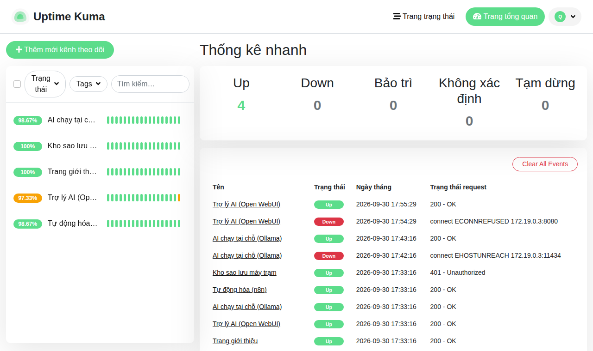

# Quản lý máy trạm từ OneBee Box

Cần: Box đã cài; mỗi máy trạm đã dán cấu hình từ `sudo onebee-box them-may <tên>` vào `/etc/onebee/may-tram.env`
và chạy lại bộ cài OneBee OS (xem [cai-dat-onebee-box.md](cai-dat-onebee-box.md), mục 4). Thiết kế: [ADR 0004](../adr/0004-quan-ly-tap-trung-va-ho-tro-tu-xa.md).

## 1. Xem tình trạng các máy
```bash
sudo onebee-box may-tram
```
```
ketoan-01  ỔN         sao lưu 5 giờ trước · báo tình trạng 12 phút trước · ổ trống 63% · đã cập nhật
kho-02     CẦN XỬ LÝ
           → chưa từng sao lưu lên Box
           → chưa báo tình trạng (máy chưa cài bản mới hoặc chưa bật lần nào)
```
Giám sát dịch vụ của chính Box (Uptime Kuma, `http://<ip-box>:3001`):



Box cảnh báo máy trạm khi: quá 3 ngày chưa sao lưu · quá 2 ngày không liên lạc · ổ hệ thống còn dưới 10% · có bản vá bảo mật chưa cài
(hoặc từ 30 gói chờ cập nhật) · cần khởi động lại. Bảng này đi kèm **email báo cáo sao lưu 23:00 hằng ngày**.

Máy trạm gửi mỗi giờ: tên, IP, phiên bản, số gói chờ cập nhật, cần khởi động lại không, ổ còn trống, đã bật bao lâu,
lần sao lưu cuối, số tài khoản có quyền sudo. **Không gửi** tên file, nội dung, lịch sử dùng máy. Gửi ngay trên máy trạm: `sudo onebee-bao-tinh-trang`.

**Nâng cấp theo thứ tự: Box trước, máy trạm sau.** Box mới nhận được cả báo cáo cũ lẫn mới. Máy trạm đã nâng cấp mà Box còn bản cũ thì quy trình
n8n cũ bỏ hết trường của báo cáo mới (Box không biết địa chỉ máy, bảng tình trạng trống).

**Báo cáo có chữ ký.** Mỗi báo cáo được ký (HMAC-SHA256) bằng khóa suy từ mật khẩu kho sao lưu của máy — mật khẩu này chưa từng đi qua
mạng. n8n (nơi nhận) không giữ khóa nên không giả được; Box tự kiểm chữ ký khi in bảng. Báo cáo sai chữ ký được nêu rõ ("giả mạo, hoặc mật
khẩu sao lưu trên máy khác với Box"); báo cáo chưa ký (máy chạy mã cũ) hiện cảnh báo "chạy lại bộ cài OneBee OS trên máy" và **không** được
dùng để chọn địa chỉ SSH máy chưa ghim (máy đã ghim vẫn dùng được: khóa SSH lệch thì dừng). Chữ ký đúng nhưng giờ ký lệch giờ Box quá 10 phút
→ cảnh báo "đồng hồ máy sai hoặc báo cáo cũ bị gửi lại" (kiểm tra giờ/NTP của máy). Chống phát lại có giới hạn: qua đường bình thường chỉ phát lại
được trong ±10 phút; n8n bị chiếm có thể phát lại báo cáo đã ký cũ nhưng địa chỉ nằm trong phần đã ký, cộng khóa SSH đã ghim và bước chứng
minh, nên không lái được SSH tới máy lạ. Box chỉ nhận báo cáo của máy **đã cấp** (`them-may`), máy đã thu hồi hoặc tên lạ bị bỏ.

## 2. Cập nhật phần mềm máy trạm
```bash
sudo onebee-box cap-nhat-may ketoan-01     # 1 máy
sudo onebee-box cap-nhat-may --tat-ca      # mọi máy đã cấp
```
Box vào máy trạm qua SSH (tài khoản `onebee-quantri`), cập nhật toàn bộ gói + ứng dụng Flatpak, rồi gửi lại tình trạng.
**Lần đầu vào một máy**, Box dùng IP trong báo cáo có chữ ký hợp lệ (mới trong 2 giờ), SSH vào và đọc mật khẩu kho sao lưu trên máy; chỉ khi
trùng với mật khẩu Box giữ (máy chứng minh được là máy đã cấp) mới **ghim khóa SSH của máy** (in "Đã ghim khóa SSH của …"). Các lần sau Box
dùng khóa đã ghim (khóa lệch thì dừng) và chứng minh lại mỗi lần. Máy giả đứng ở IP đã báo không biết mật khẩu → không được ghim, không nhận gì.
Máy tắt hoặc mất mạng → báo "không vào được", máy khác vẫn chạy tiếp. Nhật ký: `/var/log/onebee-box/cap-nhat-may-*.log`.
Máy trạm vẫn tự cập nhật hằng ngày (mintupdate) — lệnh này để cập nhật ngay, ví dụ khi có bản vá khẩn.
SSH vào máy trạm **chỉ** cho tài khoản `onebee-quantri`, bằng khóa của Box, từ IP của Box (tắt mật khẩu, tắt root,
tài khoản khác bị từ chối). Kỹ thuật cần vào máy trạm bằng dòng lệnh: SSH vào Box trước, rồi từ Box
`sudo ssh -i /etc/onebee-box/secrets/ssh/quan-tri onebee-quantri@<ip-máy-trạm>`.

- Báo "Bỏ qua …: máy chưa báo tình trạng hợp lệ trong 2 giờ qua": máy tắt, chưa chạy lại bộ cài sau khi dán cấu hình, hoặc máy chạy mã
  cũ (báo cáo chưa ký) → chạy lại bộ cài OneBee OS trên máy rồi chạy `sudo onebee-bao-tinh-trang`.
- Báo "KHÔNG chứng minh được là máy đã cấp": máy ở địa chỉ đó không biết mật khẩu kho sao lưu Box giữ — máy khác đang ở IP đó, hoặc máy
  dán nhầm cấu hình của máy khác. Kiểm tra trước khi làm gì.
- Báo "khóa SSH đã ghim không khớp" / "REMOTE HOST IDENTIFICATION HAS CHANGED": máy đã cài lại hệ điều hành (khóa SSH của máy đổi). **Chỉ khi
  chắc đó là máy của mình**: `sudo onebee-box ghim-lai-may <tên-máy>`; máy cài lại cần dán lại cấu hình (`them-may`), chạy lại bộ cài, báo
  tình trạng; rồi `sudo onebee-box cap-nhat-may <tên-máy>` (Box chứng minh lại rồi ghim khóa mới). Máy không hề cài lại mà vẫn báo → có thể
  máy khác đang giả danh.
- Máy nhân bản từ ảnh đĩa phải tạo khóa SSH riêng (`sudo ssh-keygen -A`, xem cai-hang-loat.md) — hai máy trùng khóa SSH ghim lẫn nhau.

## 2b. Đẩy lại cấu hình, thu hồi máy
```bash
sudo onebee-box dong-bo-may ketoan-01      # đẩy lại /etc/onebee/may-tram.env từ Box xuống máy (cũng chỉ tới máy đã chứng minh được)
sudo onebee-box thu-hoi-may ketoan-01      # mất máy, nhân viên nghỉ, nghi bị giả mạo (hỏi xác nhận; --dong-y để bỏ hỏi)
```
`dong-bo-may` dùng khi đổi khóa/URL: cấu hình dựng từ đúng nguồn của `them-may`, thiếu khóa nào của máy thì bỏ qua máy đó (không đẩy file
thiếu). File cũ trên máy giữ lại bản `.~`. Lệnh chỉ cập nhật file cấu hình và kiểm báo cáo chạy được; các file sinh từ cấu hình
(`/etc/onebee-hoi.conf`, mục menu) do bộ cài desktop tạo lại — chạy lại bộ cài trên máy nếu đổi dòng `HOI_*`.

`thu-hoi-may` gỡ: tài khoản kho sao lưu HTTP, tài khoản + khóa Trợ lý AI (`hoi`) của máy, khóa SSH đã ghim, chỗ nhận báo cáo tình trạng; máy
biến khỏi bảng tình trạng, báo cáo và danh sách cập nhật. **Giữ** kho sao lưu và mật khẩu kho của máy (khôi phục dữ liệu, dọn bản cũ).
Thu hồi vẫn có hiệu lực sau `khoi-phuc-toan-bo` **nếu đã có bản sao lưu Box sau lúc thu hồi** — chạy ngay `sudo onebee-box sao-luu` (lệnh nhắc
lúc thu hồi); ổ hỏng trước lần sao lưu kế tiếp thì khôi phục sẽ cấp lại máy. Cấp lại cùng tên: `them-may <tên>` — mật khẩu kho HTTP, khóa
`hoi` **và mật khẩu kho sao lưu** đều mới (mật khẩu kho cũ là khóa ký + bằng chứng danh tính máy, máy cũ bị mất cắp vẫn biết nó); kho cũ cất
sang `/srv/onebee/restic/<tên>.cu-<ngày giờ>`, mật khẩu cũ ở `/etc/onebee-box/secrets/cu-<tên>-repo-<ngày giờ>` (vẫn được `in-khoa` in).
Máy mới sao lưu từ đầu vào kho mới (kho cũ không tự dọn bản — xóa tay khi không cần). Nhật ký các lệnh
này ở `/var/log/onebee-box/` (chỉ root đọc).

## 3. Hỗ trợ từ xa (người dùng phải đồng ý)
1. Người dùng mở menu → **"Cho phép hỗ trợ từ xa (OneBee)"** → hộp thoại hiện **địa chỉ** và **mã 8 số** → đọc cho kỹ thuật.
2. Kỹ thuật mở phần mềm xem VNC bất kỳ (TigerVNC Viewer, Remmina…) → nhập `<địa chỉ>:5900` → nhập mã.
3. Máy người dùng hỏi **"Máy … xin xem và điều khiển màn hình. Cho phép?"** → người dùng bấm **Cho phép**.
4. Xong việc: kỹ thuật đóng cửa sổ VNC, hoặc người dùng bấm **"Dừng hỗ trợ"** → phiên đóng, mã hết hiệu lực.

Chỉ nhận kết nối từ mạng nội bộ (10.x, 172.16–31.x, 192.168.x) và Tailscale (100.64–127.x). Hỗ trợ từ xa ngoài đơn vị:
cài Tailscale trên máy kỹ thuật và máy trạm (cùng mạng Tailscale). Kết nối VNC không mã hóa → **ngoài LAN chỉ dùng qua Tailscale**.
Người dùng không có menu (ví dụ đang ở màn hình dòng lệnh): `onebee-ho-tro --khong-hoi` (in địa chỉ + mã ra màn hình).

## Giới hạn
- Chưa thử trên máy thật (đã kiểm trong container: báo tình trạng, cập nhật qua SSH giữa 2 container, VNC giả lập).
- Phiên Wayland chưa hỗ trợ hỗ trợ từ xa (Mint 22 mặc định X11).
- Khóa ở cửa nhận tình trạng (`TINH_TRANG_KEY`) vẫn dùng chung cho các máy của 1 Box và đi qua HTTP cho tới khi có HTTPS (kế hoạch
  `docs/security-audit.md`, Pha 4); từ bản này nó chỉ còn là bộ lọc rác ở cửa — danh tính máy do **chữ ký** bảo đảm, và địa chỉ SSH chỉ
  lấy từ báo cáo có chữ ký. Tình trạng sao lưu Box tự đọc từ kho sao lưu.
- Máy chạy mã desktop cũ vẫn báo được (dạng chưa ký) trong giai đoạn chuyển tiếp; chạy lại bộ cài trên máy để chuyển sang báo cáo có chữ ký.
